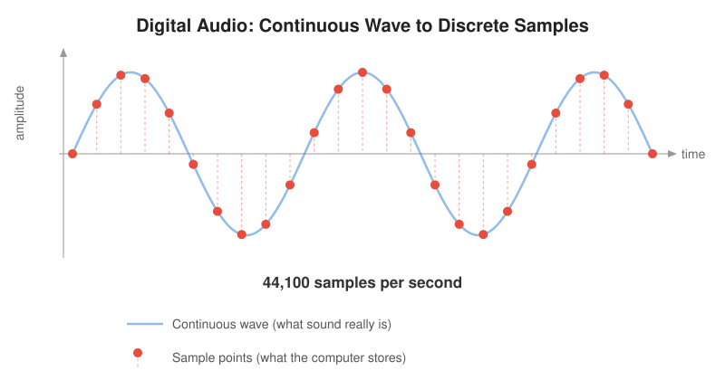
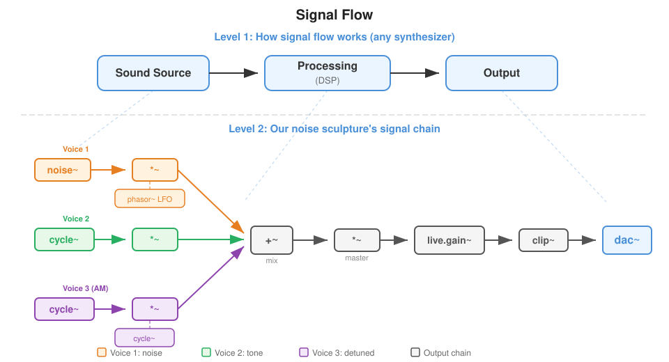
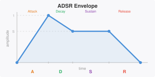
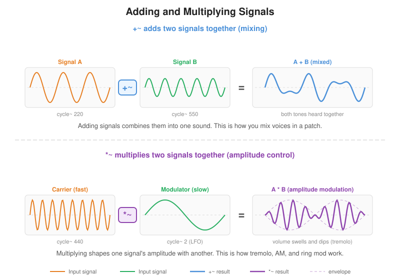
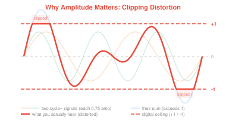

# MUSC 320 -- Week 7: Introduction to MSP


Welcome to the Max Signal Processing (MSP) module of MUSC 320. This repository contains everything you need for the lecture: Max patches to open and explore, a quick reference for the MSP objects we cover, and signal-flow diagrams.

## Getting started

You will need **Max 9** installed to open the patches.

### Download the entire repo

Click the green **Code** button at the top of this page, then choose **Download ZIP**. Unzip the folder and open any `.maxpat` file in Max.

If you are comfortable with Git you can also clone:

```
git clone https://github.com/taylorbrook/MUSC320_signals.git
```

## Key Concepts

- **Signal (MSP) versus Control Data (MAX):** Signals are continuous, high-sample-rate audio flow, while control data is  intermittent, event-based messages. 
- **Signal flow** Signal source -> signal processing -> output
- **Bridge objects:** sig~ connects the Max world to the MSP world.
- **Amplitude matters:** Always scale signals before output using *~, gain~ or live.gain~ objects just before the sending to speakers via the dac~. Full-amplitude signals, especially noise~ can be dangerously loud.
- **The output chain:**  signal -> live.gain~ -> clip~ -> dac~.
- **Audio/DSP must be on:** Toggle ezdac~ or check Audio Status before expecting sound.

## Assignment

- [Create a Sound Sculpture](docs/assignment.md) -- Build your own sound sculpture using the MSP objects from class

```{=typst}
#pagebreak()
```

## Patches

Open these in order. Each patch builds on the previous one, leading up to a full noise-sculpture patch.

```{=typst}
#block[
#set text(size: 6.5pt)
#table(
  columns: (auto, 1fr, 1fr),
  align: (center, left, left),
  [*\#*], [*Patch*], [*What it covers*],
  [1], [01-control-vs-signals-three-level-comparison.maxpat], [Control rate vs. signal rate vs. sample-level processing side by side],
  [2], [02-first-tone.maxpat], [Controlling frequency and amplitude with `cycle~` and `*~`],
  [3], [03-control-meets-signal.maxpat], [Bridging Max messages and MSP signals with `sig~` and `number~`],
  [4], [04-noise-and-amplitude.maxpat], [White noise, `noise~`, and shaping amplitude],
  [5], [05-envelopes.maxpat], [Amplitude envelopes with `line~`],
  [6], [06-modulation-and-mixing.maxpat], [LFO modulation, AM/ring mod, and mixing voices with `+~`],
  [7], [07-noise-sculpture-rebuild.maxpat], [Rebuilding the demo from scratch --- putting it all together],
)
]
```

### Bonus

- [noise-sculpture-demo.maxpat](patches/noise-sculpture-demo.maxpat) -- The finished performance instrument demonstrated in lecture

## What Is a Signal?

MSP objects process **signals** -- continuous streams of numbers, usually 48,000 or 44,100 per second. Every MSP object has a **tilde (~)** in its name. When you see ~, think "audio rate."



**Signals vs. messages:** A Max message (bang, int, float) arrives when triggered. A signal flows continuously -- 48,000 or 44,100 values every second.

## MSP Object Reference

### Signal Sources

Objects that generate signals.

- `cycle~` -- cosine/sine oscillator. First argument and left input is the frequency in Hz. 
- `noise~` -- white noise generator. Outputs random values between -1 to 1 at audio rate. ("random gives one random number per bang; noise~ gives one every sample")
- `phasor~` -- repeating 0-to-1 ramp. First argument: frequency in Hz. Used as an LFO or automation source. ("metro fires bangs at intervals; phasor~ generates a smooth repeating ramp")

### Signal Operators

Objects that transform signals.



- `*~` -- multiplies two signals, or a signal by a constant. Used for amplitude control, ring modulation, AM synthesis. ("You used * to multiply numbers; *~ multiplies signals")
- `+~` -- adds two signals together. Used for combining or "mixing" audio streams together or adding DC offset.
- `sig~` -- converts a Max number to a continuous MSP signal.
- `line~` -- generates smooth ramps at audio rate. Message format: `target time` (e.g., `1. 500` ramps to 1.0 over 500 ms). ("line~ is the signal version of line -- smooth ramps at audio rate instead of message rate")





### Output and Safety

Getting signal to speakers safely.

- `dac~` -- digital-to-analog converter. Sends the signal out to speakers. Two inlets by default = left/right stereo.
- `ezdac~` -- same as dac~ but with a click-to-toggle UI, like the power switch in the bottom right of a MAX window.
- `live.gain~` -- volume control with built-in metering. Stereo in/out.
- `clip~` -- limits signal to a range. `clip~ -0.9 0.9` prevents dangerously loud output. Safety net before dac~.



### Monitoring

Seeing signals - great to debugging and understanding the flow in your patch.

- `live.scope~` -- oscilloscope display. Shows waveform shape in real time.
- `number~` -- displays signal value at control rate. Mode 2 = display only (no output).
- `meter~` -- displays signal as an led-style meter. 

### Bonus

Objects worth exploring on your own -- option-click any object in Max to open its help file.

- `pink~` -- pink noise generator. Like noise~ but with less high-frequency energy, producing a warmer, more natural noise.
- `onepole~` -- simple one-pole low-pass filter. Smooths a signal by rolling off high frequencies. Useful for shaping noise or smoothing control signals.
- `adsr~` -- attack-decay-sustain-release envelope generator. A more flexible alternative to building envelopes with line~ -- one object handles the full ADSR shape.
